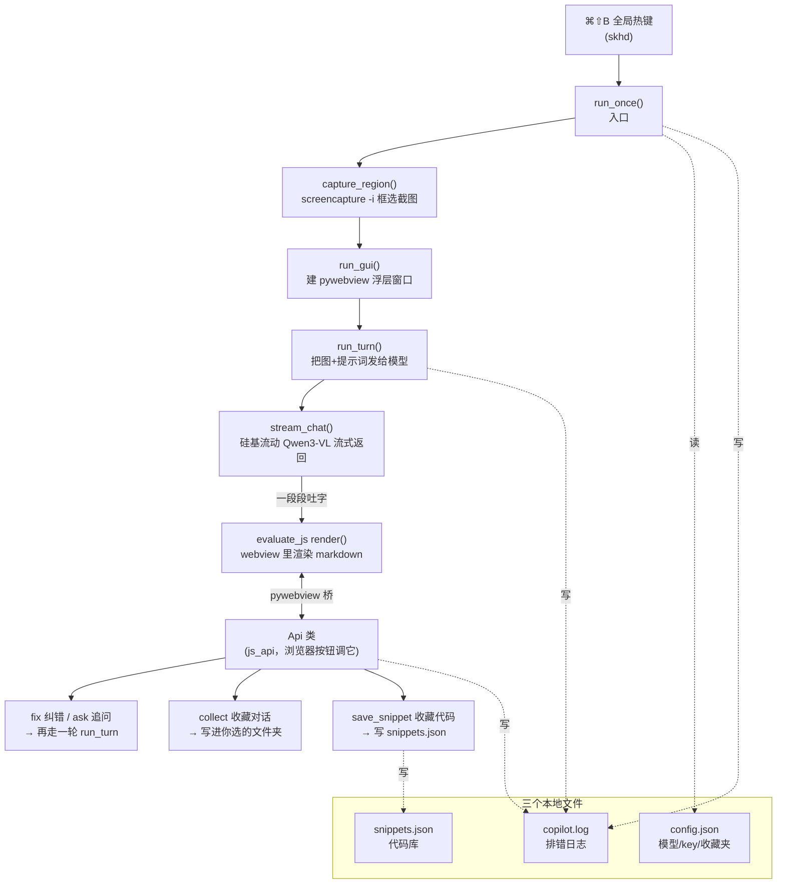

# CodePeek · 架构与功能全景

> 一个 Mac 本地小工具：框选屏幕上任意一段代码 → 浮层里用大白话讲给你听，可纠错、可追问、可把命令攒进代码库。
> 单文件实现（`code_copilot.py`），无框架、无数据库，靠三个本地文件持久化。

---

## 1. 一张图看懂它怎么连（数据流）



**一句话**：热键 → 截图 → 发模型 → 浮层流式讲解 → 你在浮层里点按钮/划选，按钮通过 pywebview 桥回调 Python 的 `Api` 类干活。

---

## 2. 一共几个功能？各干嘛？（功能清单）

| # | 功能 | 干嘛 | 触发方式 | 对应代码 |
|---|------|------|---------|---------|
| 1 | **全局唤起** | 任何软件里按 ⌘⇧B 就能起 | skhd 热键 | `run_once` + `~/.config/skhd/skhdrc` |
| 2 | **框选截图** | 拉个框把那段代码截下来 | 系统框选 | `capture_region`（`screencapture -i`） |
| 3 | **识别 + 讲解** | 大白话讲这段在干嘟，流式一段段冒 | 自动（截完就讲） | `PROMPT_EXPLAIN` → `stream_chat` → `run_turn` |
| 4 | **🔧 纠错** | 专门 debug：错在哪 + 改对的完整代码 | 工具栏按钮 | `Api.fix` + `FIX_MSG` |
| 5 | **🙋 追问** | 针对没懂的点继续问，多轮对话 | 底部输入框 | `Api.ask` → `Api._spawn` → `run_turn` |
| 6 | **临时浮层** | 小窗浮最上层，点外面/ESC 自动消失 | 失焦 / ESC / ✕ | `Api.close`（`os._exit`）+ HTML 里 blur/ESC |
| 7 | **📋 复制** | 把整段对话拷到剪贴板 | 工具栏按钮 | `Api.copy` |
| 8 | **收藏对话** | 把这次讲解存进你选的文件夹 | 📁文件夹 / ⭐收藏 / ↩︎撤销 | `set_folder` `collect` `undo_collect` |
| 9 | **📚 代码库** | 讲解里的命令攒起来，点一行即复制粘终端 | 代码块⭐ / 划选⭐ / 📚库 | `save_snippet` `library_html` `copy_snippet` `del_snippet` |
| 10 | **去中文清洗** | 收进库前砍掉中文注释，只留能跑的命令 | 收藏时自动 | `clean_code` |
| 11 | **排错日志** | 所有动作+异常写日志，出 bug 能定位 | 全程自动 | `logged` 装饰器 + `copilot.log` |

> 功能 3/4/5 其实是**同一套对话引擎**：图片放在对话第 1 条，之后每一轮（讲解/纠错/追问）都往对话里追加一句、再流式跑一遍。所以纠错和追问都"记得"前面聊过什么、也记得那张图。

---

## 3. 各功能怎么连在一起（三条主线）

1. **对话主线**：`messages` 列表贯穿始终。第 0 条 = 图片 + 讲解提示词；之后 `fix`/`ask` 都是往列表尾部加一条 user 消息，再 `run_turn` 流式生成 assistant 回复。界面上 `rendered`（累积的 HTML）一路往下追加，像聊天记录。
2. **UI 桥**：浮层是一段 HTML 字符串跑在 pywebview（WKWebView）里。JS 按钮 → `pywebview.api.xxx()` → 回到 Python 的 `Api` 方法；Python 反过来用 `window.evaluate_js("render(...)")` 更新界面。**只有 `evaluate_js` 和 subprocess 是线程安全的**（见第 5 节的坑）。
3. **持久化**：三个文件，各管一摊——`config.json`（设置）、`snippets.json`（代码库）、`copilot.log`（日志）。收藏的对话是另写进用户自选文件夹的 `CodePeek.md`。

---

## 4. 出 bug 怎么直接定位（排错钩子）

这是"埋钩子"那部分的答案：

- **`logged` 装饰器**：套在 `Api` 每个界面动作上。每次点按钮 → 日志记一行 `→ 函数名(参数)`；一旦报错 → 记 `✗ 函数名 出错` + **完整堆栈（精确到文件:行号）**，并且**吞掉异常让工具不崩**。
- **两个兜底 excepthook**：主线程、子线程（流式/追问都在子线程）里没被接住的异常，也照样写进日志。
- **生命周期打点**：`run_once` 记「唤起/截图/退出」，`run_turn` 记「第几轮请求/model/收到多少字/失败原因」。

**用法**：出问题时，打开 `copilot.log`，从下往上看——最后几行就是它干到哪一步、错在哪个函数哪一行。例：

```
01:02:39 [INFO]  → copy
01:02:39 [ERROR] ✗ copy 出错，参数=()
Traceback (most recent call last):
  File ".../code_copilot.py", line 335, in copy
    subprocess.run(["pbcopy"], input=self.transcript.encode(...))
AttributeError: 'NoneType' object has no attribute 'encode'
```
→ 一眼定位：`copy` 里 `self.transcript` 是 None。

> 日志不记 API key、不记截图内容，只记动作和堆栈，可放心。

---

## 5. 关键设计决策 / 踩过的坑（给未来的自己）

- **为什么 UI 用 pywebview 不用 Tkinter**：Tkinter 按钮背景色在 macOS 被系统忽略（显灰、丑），且排版能力弱；换 WKWebView 直接用 HTML/CSS，好看且灵活。
- **⚠️ pywebview 最大的坑（卡死根因）**：js_api 回调跑在**子线程**，而**改窗口属性（置顶 on_top）、销毁窗口（destroy）、弹原生对话框（create_file_dialog）会死锁转圈卡死**，因为这些必须在主线程。解法：
  - 关闭 → 用 `os._exit(0)` 秒杀进程（每次热键都是新进程，不需要清理）；
  - 选文件夹 → 改用 `osascript 'choose folder'`（独立进程，不碰 pywebview）；
  - 更新界面 → 只用 `window.evaluate_js(...)`（线程安全）。
- **为什么 30B 模型要流式**：非流式请求容易 read timeout；流式一上又快又稳，边收边显。
- **为什么划选要开 `text_select=True`**：pywebview 默认禁用页面文字选择，不开就划不动。
- **收藏为什么要 `clean_code`**：模型爱在命令后加中文注释，粘终端碍事；但命令里合法的中文（字符串参数、中文域名）不能删，删了命令就废——所以只砍"# / // 后面且含中文"的注释。

---

## 6. 想加功能时，从哪下手

- 加一个**工具栏按钮** → 在 HTML 的 `#bar` 里加 `<button onclick="pywebview.api.新方法()">`，再在 `Api` 里写个 `@logged def 新方法`。
- 加一个**对话动作**（像纠错） → 写一句提示词，调 `self._spawn("显示标签", 提示词)`。
- 换**模型/供应商** → 只改 `config.json` 的 `base_url` / `model`（OpenAI 兼容即可）。
